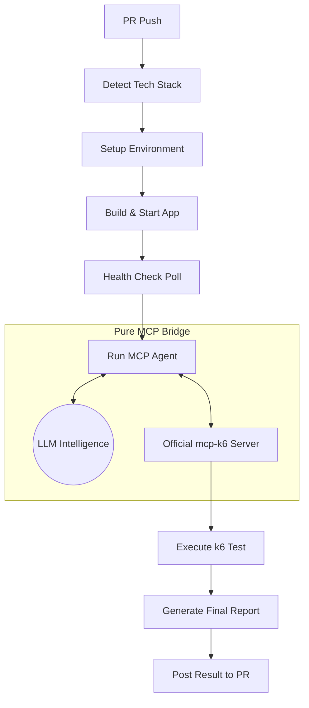

# 🚀 Automated k6 Performance Testing (Pure MCP)

This repository provides a **state-of-the-art performance testing solution** for GitHub Pull Requests, powered by the **Official [Grafana mcp-k6 server](https://github.com/grafana/mcp-k6)** and the **Model Context Protocol (MCP)**.

### 🧠 Pure MCP Architecture
This solution is "scriptless" and zero-maintenance. It uses a lightweight **MCP Agent** to communicate between your preferred LLM and the official k6 tools.

1.  **Detects** your stack (Node, Java, Python, Go, Ruby).
2.  **Starts** your app in the background.
3.  **MCP Agent** handshakes with the official `mcp-k6` server over `stdio`.
4.  **LLM Intelligence** (Ollama, OpenAI, or Anthropic) generates and analyzes results dynamically.
5.  **Official MCP Tools** handle script validation and high-performance execution.

---

## 🧠 AI Intelligence (Multi-LLM)

By default, this solution uses **local Ollama (llama3)** inside the GitHub runner for 100% privacy and zero cost. You can switch to premium models by setting GitHub Variables/Secrets:

| Variable | Default | Description |
|----------|---------|-------------|
| `LLM_PROVIDER` | `ollama` | `ollama`, `openai`, or `anthropic` |
| `LLM_MODEL` | `llama3` | `gpt-4o`, `claude-3-5-sonnet-latest`, etc. |
| `LLM_API_KEY` | *(None)* | Your OpenAI or Anthropic API key (as a Secret) |
| `LLM_URL` | `http://localhost:11434` | Custom endpoint for Ollama or local LLM |

---

## 🏁 How It Works



---

## 🚀 Quick Setup

### Step 1 — Copy the files into your repo
You only need these files:
```
your-repo/
├── .github/
│   └── workflows/
│       └── k6-performance-test.yml   ← The Workflow
├── scripts/
│   ├── mcp_agent.py                 ← The Pure MCP Bridge
│   └── start.sh                      ← App Startup Script
└── README.md
```

### Step 2 — Configure Secrets (Optional)
If using OpenAI or Anthropic, add your `LLM_API_KEY` to **GitHub Settings → Secrets → Actions**.

### Step 3 — Customize Startup
Edit `scripts/start.sh` to ensure your application starts on port `8080`.

---

## 📊 Sample Performance Report
The LLM generates a professional Markdown report directly from the k6 metrics:

| Metric | Value |
|--------|-------|
| **HTTP Request Duration** | avg: 1.49ms, p(95): 2.15ms |
| **Success Rate** | 100% |
| **Throughput** | 6,340 requests/sec |

---

## 🛠 Troubleshooting

### Security Error: DANGEROUS_PATTERN
The `mcp-k6` server has a security layer. If your LLM generates a script using `export default function()`, the server will block it. The **MCP Agent** automatically fixes this by converting it to an arrow function `export default () => {}`.

### Startup Timeout
If your app takes >90s to start, increase the `sleep` or timeout in the workflow YAML.

---
*Powered by [Grafana k6](https://k6.io) and [Model Context Protocol](https://modelcontextprotocol.io)*
