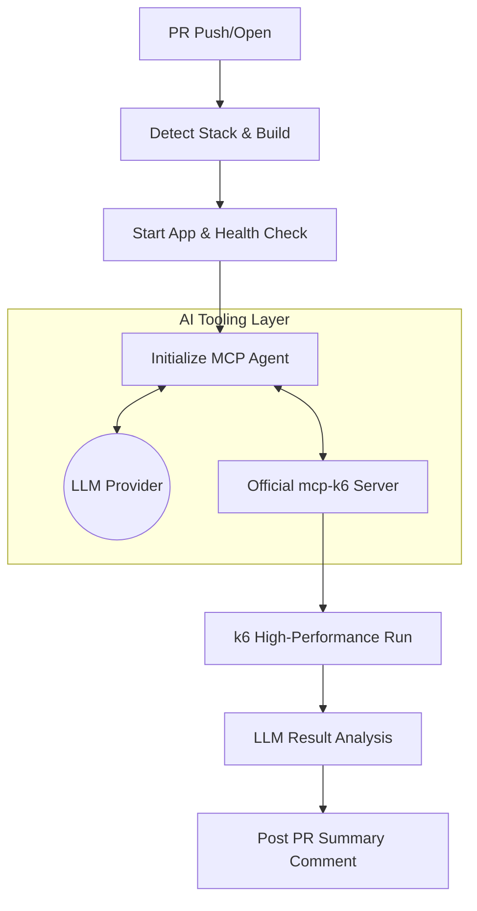

# 🚀 Automated k6 Performance Testing (Official MCP)

[](https://github.com/shadmanakbar/k6-auto-pr-performance-tests/blob/main/LICENSE)
[](https://k6.io)
[](https://modelcontextprotocol.io)

This repository provides a **professional, AI-driven performance testing solution** for GitHub Pull Requests. It leverages the **Official [Grafana mcp-k6 server](https://github.com/grafana/mcp-k6)** and the **Model Context Protocol (MCP)** to bring "Pure MCP" automation to your CI/CD pipeline.

---

## 🎨 Pure MCP Architecture
This solution is designed for **Zero-Maintenance**. It eliminates complex custom orchestrators by using a lightweight **MCP Agent** bridge and the official Grafana tooling.

1.  **🔍 Smart Detection**: Automatically identifies your tech stack (Node, Java, Go, Python, Ruby).
2.  **🏗️ Auto-Build & Start**: Builds and backgrounds your application on port `8080`.
3.  **🤖 AI Brain (Multi-LLM)**: Handshakes with an LLM of your choice (Ollama, OpenAI, Anthropic) to generate k6 scripts.
4.  **🛡️ Security Sandbox**: Validates and executes scripts via the official `mcp-k6` server with strict pattern blocking and URL whitelisting.

---

## 🏁 How It Works



---

## 🧠 Multi-LLM Support

Choose your intelligence level. The system defaults to **local Ollama** for 100% cost-free and private testing, but supports premium models via GitHub Secrets:

| Provider | Default Model | Configuration | Cost |
|----------|---------------|---------------|------|
| **Ollama** | `llama3` | Default (Local) | **$0** (Free) |
| **OpenAI** | `gpt-4o` | `LLM_PROVIDER: openai` | Token Based |
| **Anthropic** | `claude-3-5-sonnet` | `LLM_PROVIDER: anthropic` | Token Based |

---

## 🚀 Quick Setup

### 1. Copy Files to Your Repo
Drop these files into your repository at the exact paths:
```text
your-repo/
├── .github/workflows/k6-performance-test.yml
├── scripts/
│   ├── mcp_agent.py
│   └── start.sh
└── .env.example
```

### 2. Configure Startup
Edit `scripts/start.sh` and uncomment the block matching your technology stack. Ensure your app listens on **port 8080**.

### 3. Set GitHub Secrets (Optional)
If using cloud LLMs, add your `LLM_API_KEY` to **Settings → Secrets and variables → Actions**.

---

## 🛡️ Security & Privacy
The solution is built with a **Security-First** mindset:
*   **Execution Guard**: The `mcp-k6` server blocks dangerous patterns like `child_process`, `eval`, and filesystem access.
*   **Whitelisting**: The MCP Agent strictly enforces that k6 scripts ONLY target `http://localhost:8080`.
*   **In-Process Handshakes**: Communication between the agent and the server happens over standard `stdio`, never exposing tokens to the network.

---

## 📂 Project Structure
*   `.github/workflows/`: The GitHub Action automation.
*   `scripts/mcp_agent.py`: The "Pure MCP" bridge (Dependency-free Python).
*   `scripts/start.sh`: Standardized app startup script.
*   `.env.example`: Template for LLM configuration.

---
*Powered by [Grafana k6](https://k6.io) and [Model Context Protocol](https://modelcontextprotocol.io)*
